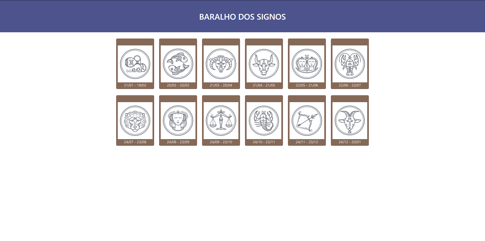

<h1>Baralho de Signos :gemini:</h1>

Projeto desenvolvido com react é uma página que mostra os signos das pessoas que nasceram em determinadas datas. Nesse projeto tinha como objetivo práticar a metodologia do MVC, Model, View, Controller

<h1>O que é MVC</h1>
O MVC é uma sigla do termo em inglês Model (modelo) View (visão) e Controller (Controle) que facilita a troca de informações entre a interface do usuário aos dados no banco, fazendo com que as respostas sejam mais rápidas e dinâmicas.
  

 
<h2 align="center">
Resultado final do projeto 🎯
</h2>

